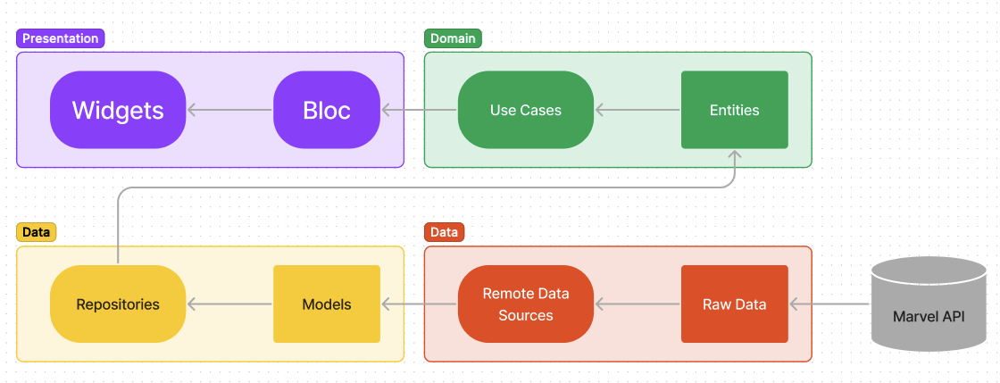

# My Marvel

My Marvel is an app that consumes the [Marvel API](https://developer.marvel.com/)

## Getting Started

- Execute: flutter pub get

To be able to make requests to the Marvel API, you will need:

- Create an account at https://developer.marvel.com/account
- Get your credentials at My Developer Account menu
- Create a string with the following: [timestamp][private key][public key]
- Go to http://www.md5.cz/ and create a md5
- Open `lib/features/characters/data/common/constants.dart` and edit the following:
    - timeStamp = 'string you created'
    - apikey = 'marvel public key'
    - hash = 'md5 you created'

## Clean Architecture

